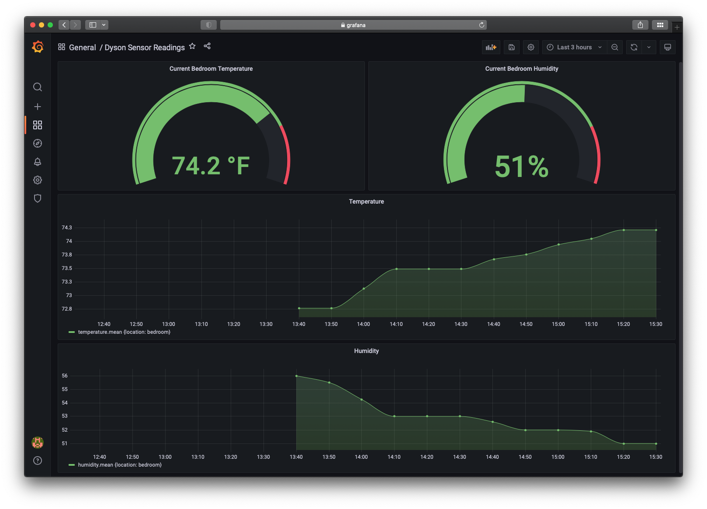

# Dyson Graph

This project aims to pull data via mqtt from local Dyson Pure Cool Link devices and push that data to InfluxDB for graphic purposes.

Could definitely be extended for other Dyson devices (since we're using LibDyson)


## Examples
Examples contains Kubernetes (k8s) examples of how to deploy the related container as a CronJob, and read from secrets to fill in the ini files containing sensitive info.

## Grafana
Here is an example of this data graphed from InfluxDB/Prometheus into Grafana:



## Setup & Running
Typically, this is best run on a recurring basis i.e. a cronjob or as a k8s CronJob. To start, you'll need to get the credentials for your Dyson fan.

Some notes for obtaining these values can be found [here](https://www.keepcalmandrouteon.com/post/dyson-graph-part-1/).

Once collected, you'll want to colocate the code with a `devices.ini` setup similarly to the example `.dist` file.

If using InfluxDB, you'll also want to setup an `influxdb.ini` file (like the example `.dist` file).

If you're using Prometheus, currently this is setup to use pushgateway.

To run the application, from the `dyson-graph` folder in a virtualenv, run `python3 __init__.py` with either the `--influxdb` option or `--prom push -pi 1.1.1.1:9091` for influx or prometheus pushgateway.

Currently the prometheus config (which curreently only does push) requires parameters entered as arguments. InfluxDB is still the default functionality in the container as well.


To setup as a cronjob in k8s, see the example files (in `examples`) for examples on setting up with influxdb or prometheus.

Happy Graphing!


### CLI Arguments
```text
usage: __init__.py [-h] [-i] [-p {push,export}] [-pi PI]

Graph some dysons

optional arguments:
  -h, --help            show this help message and exit
  -i, --influxdb        Send metrics to InfluxDB
  -p {push,export}, --prom {push,export}
                        Provide metrics for Prometheus, either push gateway or exporter
  -pi PI                prometheus pushgateway ip (for use with -p push)

```